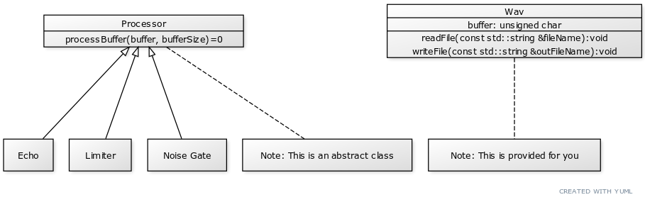

= Programming Assignment 3

In this assignment, you will be creating signal processing modules for
8-bit audio WAV files.

== Project Architecture
Your goal for this assignment is to build the classes in the `Processor` hierarchy shown below.

The `Processor` class has only one function, as shown, and no attributes. The function is _abstract_, making
the class abstract as well. This means that you cannot instantiate the class -- only its subclasses.

== Starter Project
The project includes the `Wav` class, the `main.cpp` file, a starter `makefile`, and the `Processor` class. In addition,
you are given a file called `testfile.wav` that you are to use in testing the application. As noted elsewhere,
the code that you are starting with only handles 8-bit mono WAV files such as the one provided. It will not work correctly
with any other audio file type.

== Steps

1. Watch the video at https://youtu.be/Uo4LrsN6yYs to gain an understanding of the signal processing you are to implement
in the assignment.

1. Review the `main` function in `main.cpp` to understand how the system will work.

1. Review the `Wav` class to get a general understanding. It is not required, but certainly recommended,
that you spend a bit of time understanding the binary file management in the class.

1. Create the `Limiter` class and have it inherit from the `Processor` class. The limiter should be implemented so that
the signal never exceeds 80% of its maximum value. You can implement the processors in any order you wish, however
the limiter is perhaps the easiest of the three.

.. *Recommended*: View your output files in Audacity https://www.audacityteam.org/ to verify your output. Listen
to your output wavefile and compare it to the original that was supplied in the assignment.

1. Develop the `Echo` and `NoiseGate` classes. The `Echo` class should have a constructor that allows you to
set the delay in terms of samples. The `NoiseGate` class should set to zero any values in the waveform that
are above or a threshold. The class should have a constructor that takes the threshold in terms of
percentage of maximum amplitude.

1. Check in all your code and push to Github