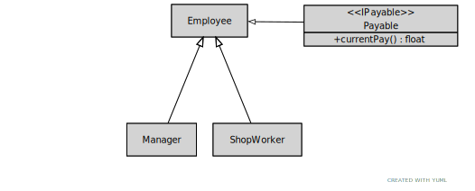

= Programming Assignment 4

== Overview
The purpose of this assignment is to give you experience in using
operator overloading, friend functions, and interfaces.

== Design Overview
The classes you will need to develop are shown in the UML diagram below.

=== The `Employee Class`
This class has the following attributes:

* first name
* last name
* employment status (active, retired, dismissed)

It has one virtual abstract function: `getEmploymentStatus`

This class inherits from the `IPayable` class defined below.

=== The `IPayable` Interface
This is an interface that defines one function: `float currentPayDue`

=== The `Manager` Class
The manager class has attributes for department name, store ID (an integer), salary per day, and
days worked since last paycheck. The `currentPayDue` function should calculate the pay based on
the days worked and the salary per day.

=== The `ShopWorker` Class
The shopworker class has attributes for department name, shop phone number, hours worked,
hourly rate, and shop ID (an integer). The shop worker is paid by the hour, so pay
should be hours worked times the hourly rate.

=== Operator Overloads
Overload the `<<` operator for the `Manager` and `ShopWorker` classes, and in both cases make the overload
a friend of the class. The expected usage will then be

    Manager *m = new Manager(...); //
    std::cout << *m << std::endl;

This should print

    Manager: <manager name here>
    Department: <department>
    Store Location: <the store location>
    Employement Status: <put status here>
    Pay Due: <current pay due>

Similarly, the output from a `ShopWorker` should list name, pay due, and then
all the attributes unique to the `ShopWorker` in the same general format as that
shown for the manager.

== Driver (in main.cpp)

1. Create a vector that will hold pointers to Employees.

2. Read in the provided employee file line by line. Follow the pseudo-code example below:

    Read the filename from the command line. Print an error message if no filename is provided
    Open the file for reading
    Skip all lines that begin with ****
    for each remaining line in the file
        If the first word is "Manager",
            Create a new Manager object with the remaining data in that line
        else if the first word is "ShopWorker",
            Create a new ShopWorker object from the remaining data in that line
        Add the pointer to the object to the Employees vector

    for each Employee *emp in the employees vector
        print the employee using "std::cout << *emp << std::endl"

