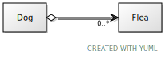

= Lab 9 - Aggregation

== The Dog and its Fleas

In this lab, you will create a `Dog` and `Flea` class.
The `Dog` can have one or more `Flea` s added to it
at any time, and the `Dog` can scratch and kill a flea.

The relationship between our `Dog` and `Flea` is shown below:

=== The `Dog` Class
* Attributes:
** name
** vector of `Flea` _pointers_

* Methods:
** `addFlea( Flea *)` : adds a flea to the dog
** `scratch()`: removes a flea from the dog, calls the flea's `die()`
method, and then deletes the flea
** `getFleaNames` : if there are fleas left on the dog, this should
return a string containing a comma separated list of the flea names. Otherwise,
it should return "No fleas on me!"
** Constructor that takes name as a parameter

=== The `Flea` Class
* Attributes:
** Name
** Hobby
** Age (as a float)
** alive : boolean set to true when the flea is instantiated
* Methods:
** `die()` : changes `alive` from true to false and prints
"aaaaaaaaaaaaarrrrrrrrrrrrrrggggggggggggghhhhhhhhhh"
** Constructor that takes name, hobby, and age as parameters

=== Application Flow
In the `main` function, create a dog object. Call
the dog's `getFleaNames` function.
Create and add fleas
named Tim, Hudson, Sarah, and Melanie to the dog. You must create
these fleas using the `new`
keyword, i.e.

 Flea* tim = new Flea(...);

Call the `getFleaNames` function again to print the names of the
current flea residents.
The dog should then scratch three times to get rid of three
fleas. Call the `getFleaNames` function  one more time to see
which flea is left on the dog.